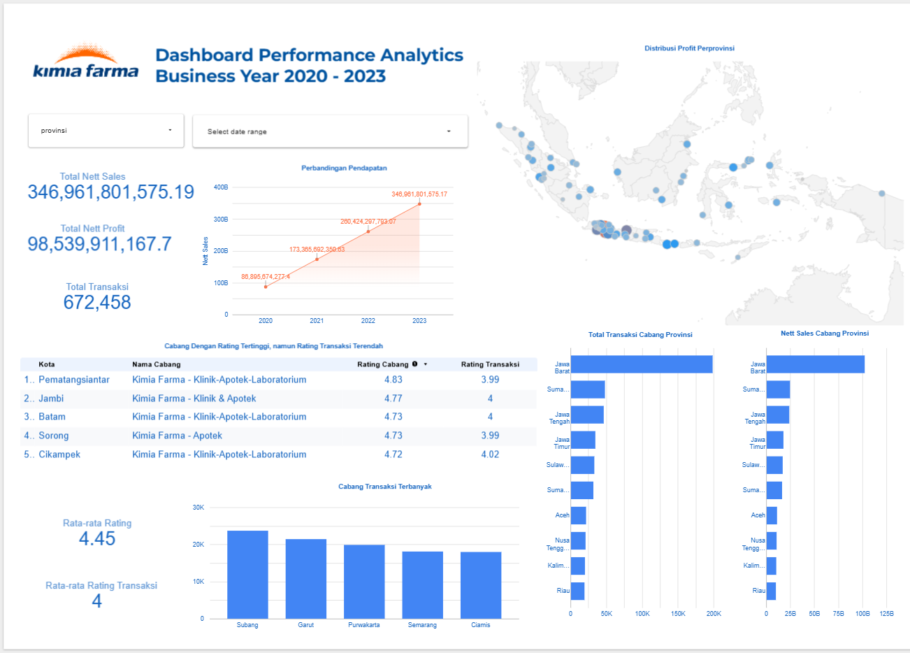

# 📊 Dashboard Kimia Farma Performance Analytics Bussiness Year 2020–2023

## 🧠 Data Story: Dari Data Transaksi ke Insight Bisnis

Project ini merupakan bagian dari pembelajaran **Big Data Analytics** yang dikembangkan melalui Project-Based Learning Rakaming Academy bekerja sama dengan Kimia Farma.

Kimia Farma adalah sebuah perusahaan farmasi BUMN yang memiliki jaringan luas di seluruh Indonesia, mulai dari produksi hingga layanan apotek. Dengan skala bisnis yang besar, data menjadi kunci penting dalam memahami performa dan menentukan strategi ke depan.

Dalam studi kasus ini, peserta berperan sebagai Data Analyst yang diminta untuk:

* Mengolah data transaksi dalam skala besar
* Menganalisis performa bisnis
* Menyajikan insight dalam bentuk dashboard interaktif

Pendekatan ini memberikan pengalaman end-to-end, mulai dari data processing hingga data storytelling.

---

## 🎯 Latar Belakang Analisis

Analisis ini berangkat dari beberapa pertanyaan utama:

* Bagaimana tren penjualan dan profit dari tahun ke tahun?
* Wilayah mana yang menjadi kontributor terbesar?
* Apakah terdapat cabang dengan performa yang belum optimal?
* Bagaimana distribusi profit secara geografis?

Untuk menjawab pertanyaan tersebut, digunakan beberapa dataset utama seperti transaksi, produk, inventory, dan cabang, yang kemudian diolah menggunakan **Google BigQuery**.

---

## ⚙️ Proses Pengolahan Data (Singkat)

Data tidak hanya digabungkan, tetapi juga dihitung ulang untuk menghasilkan metrik bisnis yang lebih representatif:

* **Nett Sales** → Harga setelah diskon
* **Nett Profit** → Nett sales × margin profit
* **Margin profit** disesuaikan berdasarkan kategori harga produk

Pendekatan ini memberikan simulasi yang lebih realistis terhadap kondisi bisnis sebenarnya.

---

## 📈 Gambaran Umum Performa

Selama periode 2020–2023:

* 💰 Total Nett Sales: **346 miliar**
* 📊 Total Nett Profit: **98 miliar**
* 🧾 Total Transaksi: **672 ribu transaksi**

Angka ini menunjukkan bahwa bisnis memiliki volume transaksi yang tinggi dengan performa profit yang stabil.

---

## 🔍 Insight Utama dari Dashboard

### 🚀 Pertumbuhan Bisnis yang Konsisten

Tren pendapatan menunjukkan kenaikan yang stabil setiap tahun dari 2020 hingga 2023.

Hal ini mengindikasikan bahwa:

* Permintaan pasar terus meningkat
* Strategi bisnis berjalan efektif
* Kemungkinan adanya ekspansi cabang

Namun, pertumbuhan ini perlu dilihat lebih dalam—apakah merata atau hanya terpusat di wilayah tertentu.

---

### 🗺️ Aktivitas Bisnis Terkonsentrasi di Pulau Jawa

Meskipun distribusi cabang tersebar di seluruh Indonesia, data menunjukkan bahwa kontribusi terbesar berasal dari Pulau Jawa, khususnya Jawa Barat.

Hal ini terlihat dari:

* Jumlah transaksi tertinggi
* Nilai penjualan terbesar

➡️ Insight penting:
Bisnis masih sangat bergantung pada wilayah tertentu, sehingga terdapat peluang besar untuk mengembangkan pasar di luar Jawa.

---

### 🏪 Kesenjangan antara Kualitas Cabang dan Aktivitas Transaksi

Beberapa cabang memiliki rating yang tinggi (di atas 4.7), namun jumlah atau kualitas transaksi tidak sebanding.

Ini menunjukkan bahwa:

* Pelayanan sudah baik
* Namun belum berhasil dikonversi menjadi transaksi yang optimal

➡️ Artinya, ada peluang untuk:

* Meningkatkan promosi
* Meningkatkan awareness
* Mengoptimalkan strategi penjualan di cabang tersebut

---

### ⭐ Customer Experience Sudah Baik, Tapi Masih Bisa Ditingkatkan

Rata-rata:

* Rating cabang: **4.45**
* Rating transaksi: **4.0**

Ini menunjukkan bahwa secara umum pelanggan sudah puas, namun pengalaman transaksi masih bisa ditingkatkan agar lebih optimal.

---

### 🏆 Cabang dengan Performa Tinggi sebagai Benchmark

Cabang seperti:

* Subang
* Garut
* Purwakarta

memiliki jumlah transaksi yang paling tinggi.

➡️ Insight:
Cabang-cabang ini dapat dijadikan **benchmark** untuk meningkatkan performa cabang lain, baik dari segi operasional maupun strategi bisnis.

---

## 📌 Kesimpulan

Dari keseluruhan analisis dapat disimpulkan bahwa:

* Bisnis mengalami **pertumbuhan yang konsisten**
* Kontribusi terbesar masih berasal dari wilayah Jawa
* Kualitas layanan sudah baik secara umum
* Namun terdapat peluang untuk mengoptimalkan cabang dengan performa transaksi rendah

Dengan memanfaatkan insight ini, perusahaan dapat merancang strategi yang lebih tepat, baik dalam ekspansi wilayah maupun peningkatan performa cabang.

---

## 🛠️ Tools yang Digunakan

* Google BigQuery
* SQL
* Looker Studio

---

## ✨ Penutup

Melalui pendekatan Big Data Analytics, data tidak hanya menjadi kumpulan angka, tetapi dapat diolah menjadi insight yang membantu pengambilan keputusan bisnis secara lebih strategis.
